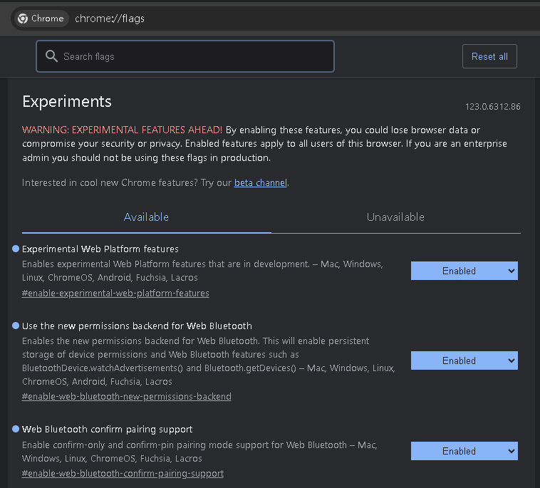

***

### Setup esp-idf on ubuntu
[link](https://docs.espressif.com/projects/esp-idf/en/latest/esp32/get-started/linux-macos-setup.html)
  

### Clone code
`git clone https://github.com/eiffelpeter/esp32_mpu6050_chrome_ble.git`


### Connect esp32 and mpu6050


### Build and flash esp32
```
cd ble_mpu6050
idf.py set-target esp32
idf.py build
idf.py -p /dev/ttyUSB0 flash monitor
```

***

### Enable BLE on chrome



### Execute html to connect esp32 BLE
`ble_mpu6050/chrome/chrome_esp32_ble_accel.html`


### Demo on chrome
[](https://drive.google.com/file/d/14BpTHdKoWap-UEXso_6OFyd7D1gNAIAs/view?usp=sharing)

***

### Reference 
1. [esp-idf-mpu6050-dmp](https://github.com/nopnop2002/esp-idf-mpu6050-dmp)
2. [HTML5-BLE-eAR](https://github.com/bennyplo/HTML5-BLE-eAR/tree/master?tab=readme-ov-file)
3. [node-imu-cube](https://github.com/gregfedirko/node-imu-cube)
4. [micro:bit and pc](https://zenn.dev/saba/articles/6a177c00fd0550a2f78f)
