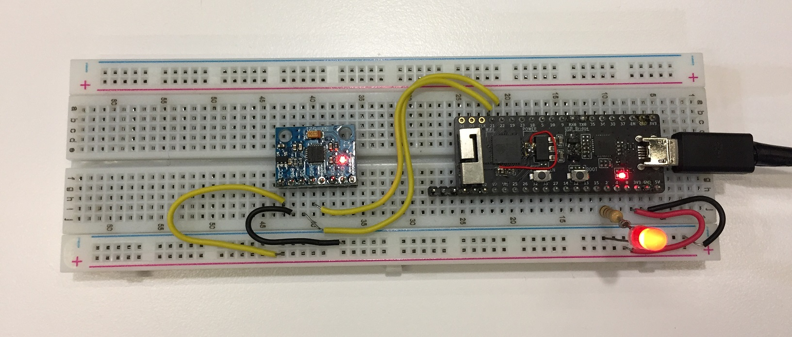

***

# Setup esp-idf on ubuntu
[link](https://docs.espressif.com/projects/esp-idf/en/latest/esp32/get-started/linux-macos-setup.html)
  

# Clone code
`git clone https://github.com/eiffelpeter/esp32_mpu6050_chrome_ble.git`

# Connect esp32 and mpu6050


# Build and program it
```
idf.py set-target esp32
idf.py build
idf.py -p /dev/ttyUSB0 flash monitor
```

# Enable BLE on chrome


# Execute html to connect esp32 BLE
`chrome/chrome_esp32_ble_accel.html`

# Demo on windows
[](https://drive.google.com/file/d/1eNkAKaKVG8bJvVYZDnKEYRxeGJdmrHrm/view?usp=sharing)
